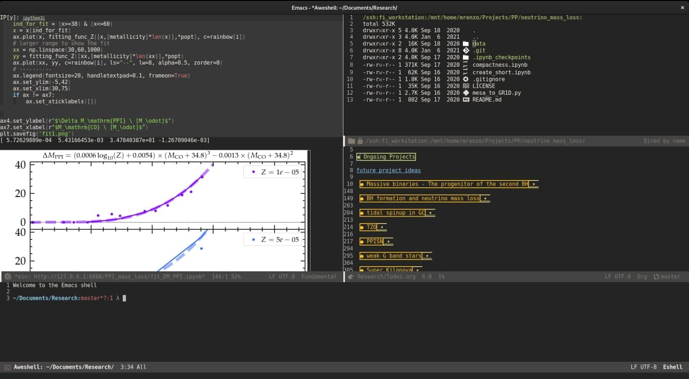

* Emacs configuration

Tested and currently working with emacs =29.2=, the most up-to-date
branch is =t14=.

See [[./dot-emacs.d/README.org][README.org]] inside =dot-emacs.d/= for the description of the
configuration itself, which is described in literate org file.
=dot-emacs= is auxiliary file created by changing some emacs faces.

I manage my emacs configuration with GNU stow, see [[file:dot-emacs.d/README.org::*File management][here]].

** Screenshot

   Wombat theme, [[https://github.com/seagle0128/doom-modeline][doom line]]. [[https://github.com/millejoh/emacs-ipython-notebook][ein]] Ipython notebook running on remote
   server showing inline plot with matplotlib, [[https://www.emacswiki.org/emacs/TrampMode][TRAMP]] remote folder,
   org notes file, and [[https://github.com/manateelazycat/aweshell][aweshell]] pop-up terminal in the bottom (I now
   use the built-in =term= with =zsh=).

   

   I also write my notes in =org= mode, and have custom export to
   various formats (=tex= \rightarrow =pdf= for printing, =html= to make websites,
   etc.).

** Installing Emacs 30.1

*Prerequisites*:

#+begin_src bash
sudo apt build-dep emacs
sudo apt install libgccjit-12-dev libtree-sitter-dev libjansson-dev \
  libsqlite3-dev libharfbuzz-dev libcairo2-dev librsvg2-dev \
  libgnutls28-dev libxml2-dev libgif-dev libtiff-dev
#+end_src

Then download emacs 30.1, unpack it, get in the folder and configure
with

#+begin_src bash
./configure \
  --with-native-compilation=aot \
  --with-tree-sitter \
  --with-x-toolkit=gtk3 \
  --with-toolkit-scroll-bars \
  --with-cairo \
  --with-harfbuzz \
  --with-gnutls \
  --with-xml2 \
  --with-rsvg \
  --with-imagemagick \
  --with-jpeg \
  --with-png \
  --with-gif \
  --with-tiff \
  --with-xpm \
  --with-modules \
  --with-threads \
  --with-sqlite3 \
  --with-mailutils \
  --with-sound=alsa \
  --without-gconf \
  --with-pop=yes \
  --disable-gc-mark-trace
#+end_src

then =make -j= and test running =./src/emacs -Q=. If vanilla emacs looks
good, install system-wide with =sudo make install=.
